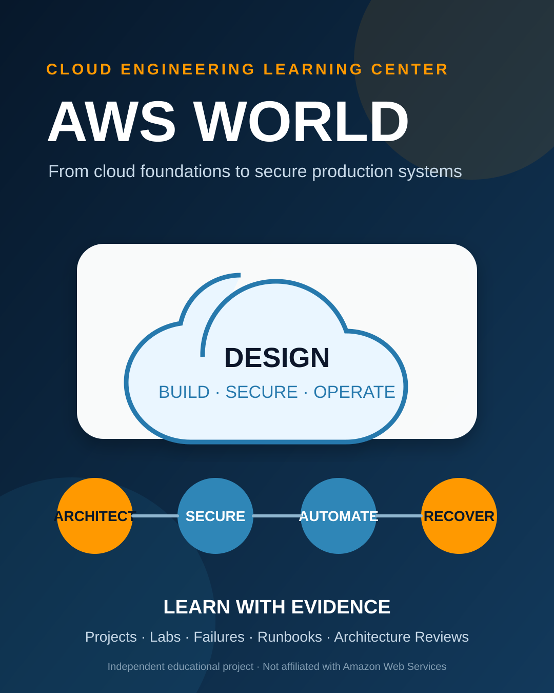
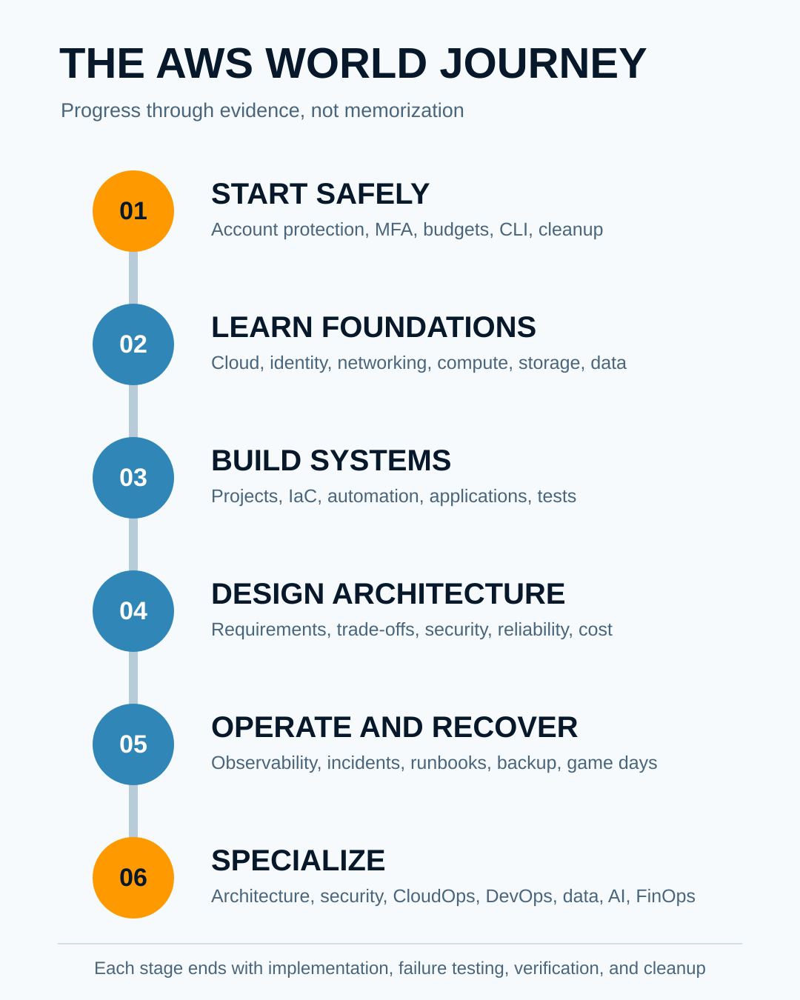
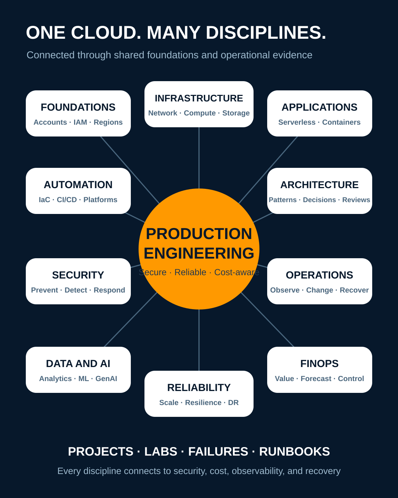
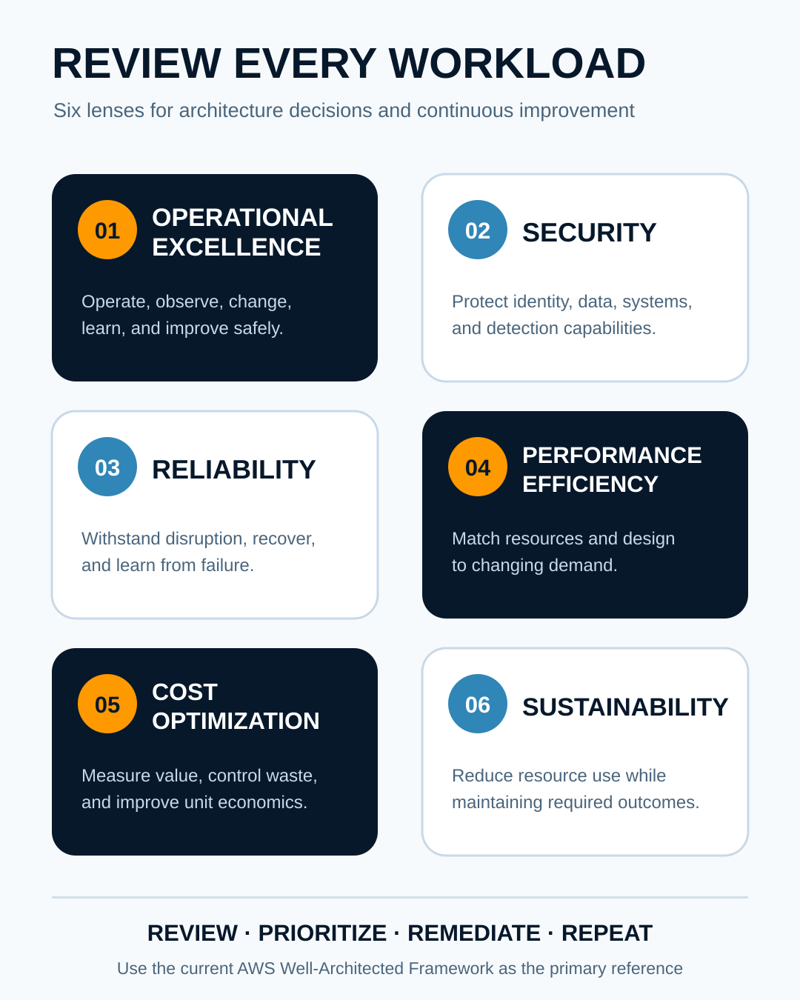

<div align="center">
  

  <h1>AWS World</h1>

  <p><strong>Learn AWS. Build real systems. Investigate failures. Operate production with confidence.</strong></p>

  <p>
    A complete learning and engineering center for AWS Cloud, solutions architecture,
    security, CloudOps, DevOps, networking, data, artificial intelligence,
    FinOps, migration, reliability, and production operations.
  </p>

  <p>
    <a href="00-Start-Here/README.md">Start Here</a> ·
    <a href="01-Beginner-to-Advanced/README.md">Learning Path</a> ·
    <a href="20-Projects/README.md">Projects</a> ·
    <a href="21-Labs/README.md">Labs</a> ·
    <a href="22-Troubleshooting/README.md">Troubleshooting</a> ·
    <a href="25-Certification-Preparation/README.md">Certifications</a>
  </p>
</div>

---

## AWS knowledge that survives the console

AWS World teaches more than service names and console clicks. It develops the judgment required to design, secure, automate, troubleshoot, and operate cloud systems.

The repository connects four forms of competence:

- **Knowledge:** Understand cloud concepts, AWS services, constraints, and trade-offs.
- **Implementation:** Build working systems through guided and independent projects.
- **Investigation:** Diagnose realistic failures using evidence instead of guesswork.
- **Operations:** Run workloads safely with monitoring, security, cost control, recovery, and clear ownership.

AWS provides hundreds of services. Memorizing all of them is not the goal. The goal is to understand how to select and combine services to solve real problems.

## Begin safely

> [!CAUTION]
> AWS resources can create charges and expose systems or data when configured incorrectly. Before beginning any lab, protect the root user, enable multi-factor authentication, configure budgets and billing alerts, confirm the active account and Region, review required permissions, and read the cleanup procedure.

Start with [`00-Start-Here`](00-Start-Here/README.md) before creating resources.

Every lab and project should begin with an identity and configuration check:

```bash
aws sts get-caller-identity
aws configure list
aws configure get region
```

These commands confirm the active identity, credential source, and default Region. They do not prove that an action is safe or free.

## Choose a learning path

| Goal | Recommended starting point | Progression |
| --- | --- | --- |
| New to cloud computing | [`00-Start-Here`](00-Start-Here/README.md) | Safety → cloud foundations → core AWS services → guided labs |
| Learn AWS from beginner to advanced | [`01-Beginner-to-Advanced`](01-Beginner-to-Advanced/README.md) | Foundations → implementation → architecture → operations |
| Become a Solutions Architect | [`13-Well-Architected-and-Solutions-Architecture`](13-Well-Architected-and-Solutions-Architecture/README.md) | Requirements → trade-offs → patterns → architecture reviews |
| Become a Cloud or CloudOps Engineer | [`12-Observability-and-CloudOps`](12-Observability-and-CloudOps/README.md) | Provisioning → monitoring → automation → incidents → recovery |
| Become an AWS Security Engineer | [`14-Security-Risk-and-Compliance`](14-Security-Risk-and-Compliance/README.md) | Identity → data protection → detection → response → governance |
| Build cloud delivery platforms | [`10-Infrastructure-as-Code-and-Automation`](10-Infrastructure-as-Code-and-Automation/README.md) | IaC → CI/CD → policy → testing → platform operations |
| Learn AWS networking | [`04-Networking-and-Content-Delivery`](04-Networking-and-Content-Delivery/README.md) | VPC → routing → DNS → hybrid → multi-Region |
| Prepare for certification | [`25-Certification-Preparation`](25-Certification-Preparation/README.md) | Current objectives → domain study → labs → readiness assessment |
| Build a portfolio | [`20-Projects`](20-Projects/README.md) | Guided projects → independent builds → capstones |
| Practise production failures | [`22-Troubleshooting`](22-Troubleshooting/README.md) | Symptoms → evidence → hypothesis → recovery → prevention |

<div align="center">
  
</div>

## Explore AWS World

### Foundations and core infrastructure

| Area | What it develops |
| --- | --- |
| [`Cloud and AWS Foundations`](02-Cloud-and-AWS-Foundations/README.md) | Regions, Availability Zones, APIs, endpoints, ARNs, quotas, pricing, and shared responsibility |
| [`Accounts, Identity and Governance`](03-Accounts-Identity-and-Governance/README.md) | IAM, Organizations, policies, federation, landing zones, audit, and multi-account control |
| [`Networking and Content Delivery`](04-Networking-and-Content-Delivery/README.md) | VPCs, routing, DNS, load delivery, hybrid connectivity, segmentation, and packet paths |
| [`Compute`](05-Compute/README.md) | EC2, scaling, load balancing, images, scheduling, placement, and compute selection |
| [`Storage, Backup and Disaster Recovery`](06-Storage-Backup-and-Disaster-Recovery/README.md) | Object, block and file storage, lifecycle, replication, backup, restore, RPO, and RTO |
| [`Databases and Caching`](07-Databases-and-Caching/README.md) | Relational, key-value, document, graph, time-series, caching, and database selection |

### Applications, automation and platforms

| Area | What it develops |
| --- | --- |
| [`Serverless and Application Integration`](08-Serverless-and-Application-Integration/README.md) | Functions, APIs, events, queues, workflows, retries, ordering, and idempotency |
| [`Containers and Orchestration`](09-Containers-and-Orchestration/README.md) | ECR, ECS, EKS, Fargate, workload identity, networking, storage, scaling, and upgrades |
| [`Infrastructure as Code and Automation`](10-Infrastructure-as-Code-and-Automation/README.md) | CloudFormation, CDK, Terraform, testing, drift, policy, state, and safe automation |
| [`Developer Tools and CI/CD`](11-Developer-Tools-and-CI-CD/README.md) | Build, artifact, deployment, OIDC, delivery strategies, quality gates, and rollback |
| [`Observability and CloudOps`](12-Observability-and-CloudOps/README.md) | Metrics, logs, traces, events, dashboards, alarms, runbooks, and operational investigation |

### Architecture, security and organizational control

| Area | What it develops |
| --- | --- |
| [`Well-Architected and Solutions Architecture`](13-Well-Architected-and-Solutions-Architecture/README.md) | Requirements, constraints, architecture decisions, fault isolation, resilience, and trade-offs |
| [`Security, Risk and Compliance`](14-Security-Risk-and-Compliance/README.md) | Preventive, detective and responsive controls across identity, data, network, workload, and organization |
| [`Cost Management and FinOps`](15-Cost-Management-and-FinOps/README.md) | Cost visibility, allocation, forecasting, commitment management, anomalies, and unit economics |
| [`Data, Analytics and Streaming`](16-Data-Analytics-and-Streaming/README.md) | Data lakes, warehouses, processing, governance, quality, batch, and streaming architectures |
| [`AI, ML and Generative AI`](17-AI-ML-and-Generative-AI/README.md) | SageMaker, Bedrock, model selection, RAG, agents, MLOps, evaluation, security, and responsible AI |
| [`Migration, Hybrid and Edge`](18-Migration-Hybrid-and-Edge/README.md) | Discovery, migration strategies, waves, cutover, hybrid services, rollback, and modernization |
| [`Reliability, Performance and Resilience`](19-Reliability-Performance-and-Resilience/README.md) | Capacity, scaling, throttling, load testing, chaos engineering, game days, and recovery |

<div align="center">
  
</div>

## Learn by building

Knowledge becomes useful when it can be implemented, tested, explained, and recovered.

AWS World projects are designed to produce real engineering evidence:

- Architecture diagrams
- Infrastructure as Code
- CLI, SDK, or automation scripts
- Security and IAM decisions
- Cost estimates and budget controls
- Observability and alerting
- Acceptance tests
- Failure-injection evidence
- Troubleshooting records
- Recovery and rollback procedures
- Operations runbooks
- Cleanup verification
- Portfolio and interview notes

### Project levels

| Level | Guidance | Expected ownership |
| --- | --- | --- |
| Junior | Complete instructions, commands, expected output, tests, and reference solution | Reproduce safely and explain each major step |
| Mid-level | Architecture requirements, starter components, test criteria, and partial guidance | Make and defend implementation decisions |
| Senior | Production scenario, constraints, failure tests, risk requirements, and review criteria | Design for security, reliability, cost, operations, and organizational impact |
| Capstone | Milestones, integration requirements, game days, and portfolio criteria | Combine multiple domains into a defensible production-style system |

Explore [`20-Projects`](20-Projects/README.md) and [`21-Labs`](21-Labs/README.md).

## Failure is part of the lesson

AWS World does not teach only successful deployments. Labs and case files include failures such as:

- Access denied despite an attached IAM policy
- Private workloads unable to reach required endpoints
- Broken routes, DNS, security groups, and network ACLs
- EC2 boot, metadata, storage, and Systems Manager failures
- Load balancer health-check failures
- Auto Scaling launch failures
- Lambda timeouts, concurrency pressure, and retry storms
- Queue backlogs and dead-letter accumulation
- Database connection exhaustion, failover, lag, and lock contention
- Container image, networking, identity, scheduling, and node failures
- Missing logs, misleading dashboards, and noisy alerts
- Backup success without recoverability
- Multi-Region replication and failover errors
- Unexpected data-transfer, NAT, logging, or idle-resource costs

The investigation model is consistent:

```text
Symptom
→ Impact and blast radius
→ Recent changes
→ Identity, configuration and dependency checks
→ Metrics, logs, traces, events and CloudTrail
→ Competing hypotheses
→ Discriminating tests
→ Mitigation
→ Recovery
→ Verification
→ Prevention
```

Explore [`22-Troubleshooting`](22-Troubleshooting/README.md) and [`23-Production-Operations`](23-Production-Operations/README.md).

## Architecture is more than drawing boxes

Every architecture should identify:

- Business and technical requirements
- Assumptions and constraints
- Availability and recovery objectives
- Data classification and trust boundaries
- Identity and authorization paths
- Network and data flows
- Regional, zonal, and global dependencies
- Scaling behavior and service quotas
- Observability and operational ownership
- Failure modes and blast radius
- Cost drivers and forecasts
- Deployment, rollback, backup, and recovery
- Alternatives and rejected options

AWS World uses the six AWS Well-Architected pillars as a consistent review lens:

<div align="center">
  
</div>

| Pillar | Central question |
| --- | --- |
| Operational excellence | Can the workload be operated, observed, changed, and improved safely? |
| Security | Are identity, data, systems, and detection protected through explicit controls? |
| Reliability | Can the workload withstand, recover from, and learn from failure? |
| Performance efficiency | Are resources and architectures matched to changing demand? |
| Cost optimization | Is value measured and waste controlled throughout the workload lifecycle? |
| Sustainability | Is resource use reduced while required outcomes are maintained? |

Architecture guidance lives in [`13-Well-Architected-and-Solutions-Architecture`](13-Well-Architected-and-Solutions-Architecture/README.md) and reusable designs live in [`24-Architecture-Patterns`](24-Architecture-Patterns/README.md).

## Role-based development

AWS World supports overlapping roles without creating isolated copies of the same material.

| Role | Primary capabilities |
| --- | --- |
| Solutions Architect | Requirements, service selection, trade-offs, reliability, security, cost, migration, and communication |
| Cloud Engineer | Accounts, networking, compute, storage, automation, monitoring, and operations |
| CloudOps Engineer | Observability, incidents, changes, backup, recovery, patching, and operational readiness |
| Security Engineer | Identity, encryption, network controls, detection, vulnerability management, response, and compliance |
| DevOps Engineer | CI/CD, infrastructure automation, containers, observability, release safety, and platform integration |
| Platform Engineer | Landing zones, developer platforms, guardrails, service catalogs, multi-account automation, and reliability |
| SRE | Service objectives, error budgets, capacity, alert quality, incident response, game days, and toil reduction |
| Network Engineer | Address planning, routing, DNS, hybrid connectivity, inspection, segmentation, and packet analysis |
| Data Engineer | Data ingestion, storage, cataloging, processing, streaming, quality, governance, and analytics |
| AI and ML Engineer | Data preparation, model development, inference, evaluation, MLOps, observability, safety, and cost |
| FinOps Practitioner | Allocation, forecasting, commitment planning, anomalies, unit economics, and accountability |
| Auditor or GRC Practitioner | Evidence, configuration, identity, logging, control mapping, exceptions, and continuous assurance |

## Certification preparation without examination fraud

Certification material follows the current exam guide published by AWS. It connects exam domains to practical implementation, architecture scenarios, service comparisons, troubleshooting, and readiness evidence.

AWS World does not accept:

- Leaked examination questions
- Memorized answer dumps
- Unauthorized course copies
- Claims that a question bank guarantees a passing result
- Material that encourages candidates to violate examination rules

Certifications and exam codes change. The [`Certification Registry`](25-Certification-Preparation/Certification-Registry.md) and [`Exam Version and Retirement Tracker`](25-Certification-Preparation/Exam-Version-and-Retirement-Tracker.md) should be reviewed before beginning a study plan.

## Production safety standard

Every AWS lab, project, command, script, and runbook should state:

- Required account, role, Region, and permissions
- Estimated cost and Free Tier assumptions
- Services and resources created
- Data classification and public exposure risk
- Resource tags
- Service quotas and expected capacity
- Logging and audit requirements
- Expected runtime
- Cleanup procedure
- Cleanup verification
- Rollback or recovery plan
- Irreversible actions

Never run unfamiliar automation against a production account. Never publish credentials. Prefer temporary role credentials and federation over long-lived access keys.

## Evidence over completion claims

A completed lesson, lab, or project should produce evidence. Depending on the activity, evidence may include:

- A successful automated test
- A verified architecture deployment
- A cost estimate compared with actual cost data
- CloudTrail, configuration, metric, log, or trace evidence
- A security-control test
- A controlled failure and recovery record
- A timed backup-restore or disaster-recovery test
- An architecture decision record
- A runbook or postmortem
- A cleaned account with resource-deletion verification

Reading, watching, copying, or deploying without understanding is not completion.

## Repository standards

Content should be:

- Based on current primary AWS documentation
- Explicit about versions, Regions, quotas, and limitations
- Reproducible in an isolated learning account
- Secure by default
- Cost-aware
- Testable
- Accessible
- Clear about cleanup and rollback
- Honest about trade-offs
- Reviewed when AWS changes a service, exam, price model, or recommended practice

## Official references

- [AWS Documentation](https://docs.aws.amazon.com/)
- [AWS Well-Architected Framework](https://docs.aws.amazon.com/wellarchitected/latest/framework/welcome.html)
- [AWS Architecture Center](https://aws.amazon.com/architecture/)
- [AWS Security Documentation](https://docs.aws.amazon.com/security/)
- [AWS Prescriptive Guidance](https://docs.aws.amazon.com/prescriptive-guidance/)
- [AWS Workshops](https://workshops.aws/)
- [AWS Training and Certification](https://aws.amazon.com/training/)
- [AWS Certification](https://aws.amazon.com/certification/)
- [AWS Service Health Dashboard](https://health.aws.amazon.com/health/status)
- [AWS What's New](https://aws.amazon.com/new/)

## Contributing

Contributions are welcome when they improve technical accuracy, reproducibility, safety, accessibility, or learning value.

Before contributing:

1. Read [`CONTRIBUTING.md`](CONTRIBUTING.md).
2. Follow [`RESOURCE-STANDARD.md`](RESOURCE-STANDARD.md).
3. Test procedures in an isolated AWS account.
4. Remove credentials, account identifiers, private addresses, and customer information.
5. Include cost, security, verification, cleanup, and rollback information.
6. Link important claims to official AWS documentation.
7. Do not submit certification dumps or copied proprietary content.

Security concerns should follow [`SECURITY.md`](SECURITY.md) instead of public issue discussion.

## License and trademarks

Repository content is governed by [`LICENSE`](LICENSE) and [`NOTICE.md`](NOTICE.md). Third-party material retains its original ownership and license.

AWS, Amazon Web Services, and AWS service names are trademarks of Amazon.com, Inc. or its affiliates. AWS World is an independent educational project. It is not affiliated with, sponsored by, or endorsed by Amazon Web Services.

---

<div align="center">
  <strong>Build it. Secure it. Break it safely. Recover it. Explain every decision.</strong>
</div>
