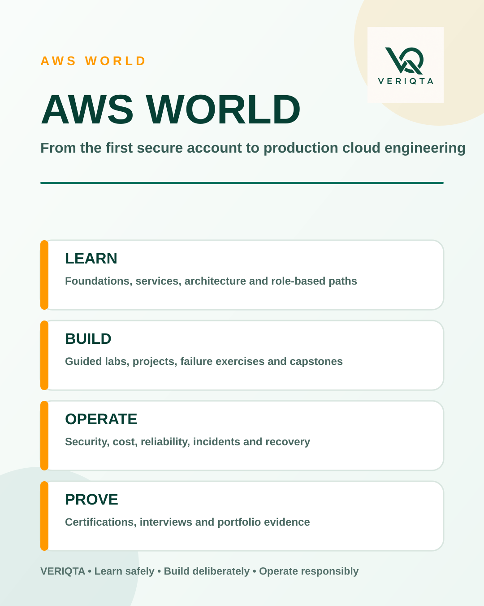
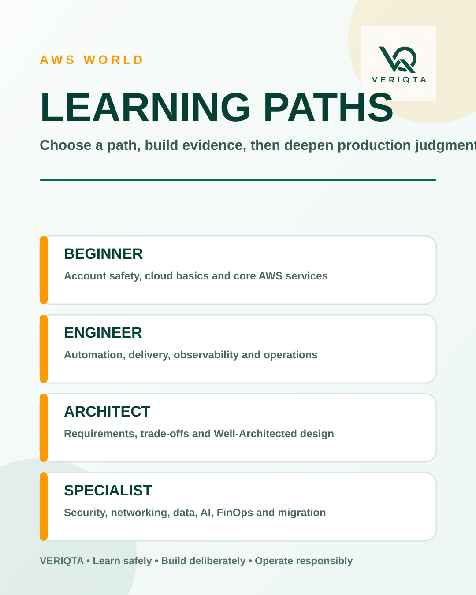
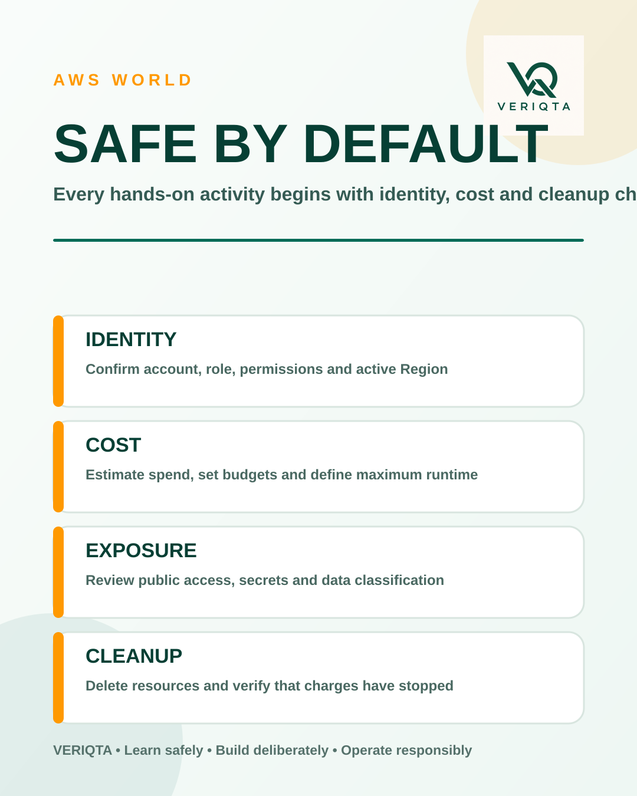
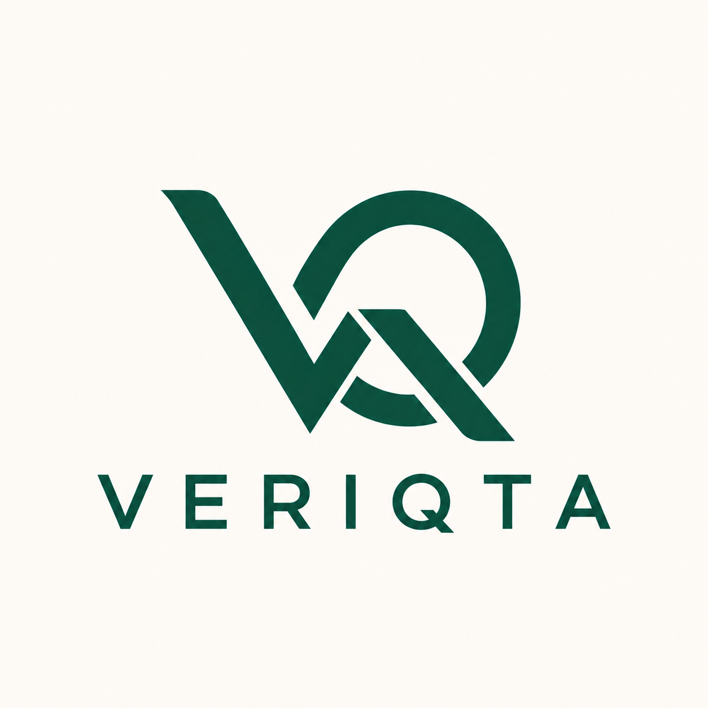

  

# AWS World

AWS World is a structured learning and engineering center for Amazon Web Services. It connects foundational cloud knowledge with architecture, security, automation, cost management, troubleshooting, reliability, production operations, certification preparation, and portfolio-ready implementation.

The repository is designed for learners and practitioners who need more than service descriptions. Resources are organized to explain **why a service exists, how it behaves, how to implement it, how it fails, how to secure it, how much it may cost, how to verify it, and when a different design is better**.

> Begin with [`00-Start-Here`](00-Start-Here/README.md). Secure the account, configure billing safeguards, understand cleanup, and choose a learning path before creating resources.

## What AWS World covers

- Cloud and AWS foundations
- Accounts, IAM, organizations, governance, and landing zones
- Networking, DNS, hybrid connectivity, private access, and content delivery
- Compute, storage, databases, serverless, containers, and integration
- Infrastructure as code, automation, developer tooling, and CI/CD
- Observability, CloudOps, production operations, and incident response
- Solutions architecture and the AWS Well-Architected Framework
- Security engineering, compliance, risk, detection, and forensics
- Cost management, FinOps, commitments, allocation, and cost incidents
- Data platforms, analytics, streaming, AI, ML, and generative AI
- Migration, modernization, hybrid, edge, SaaS, and specialized workloads
- Projects, labs, troubleshooting, interviews, certifications, and engineering notebooks
- A maintained AWS service catalog and curated resources

  

## Who this repository serves

AWS World supports:

- Complete cloud beginners and AWS Cloud Practitioner learners
- System administrators moving into cloud engineering
- Cloud Support and CloudOps engineers
- Solutions architects and cloud engineers
- DevOps, platform, and site reliability engineers
- Security, network, data, machine-learning, and FinOps professionals
- Cloud auditors and governance, risk, and compliance practitioners
- Certification and technical interview candidates

## Learn, build, operate, and prove

| Dimension | Purpose | Evidence produced |
| --- | --- | --- |
| Learn | Build accurate mental models and service knowledge | Notes, knowledge checks, comparisons |
| Build | Implement systems through labs and projects | Infrastructure code, scripts, diagrams, tests |
| Operate | Investigate failures, manage change, and recover services | Runbooks, timelines, verification, postmortems |
| Prove | Prepare for roles, interviews, and certifications | Portfolio records, assessments, scenario responses |

## Choose a starting path

| Goal | Start here | Continue with |
| --- | --- | --- |
| New to cloud | [`00-Start-Here`](00-Start-Here/README.md) | [`01-Beginner-to-Advanced`](01-Beginner-to-Advanced/README.md) |
| Become a cloud engineer | [`02-Cloud-and-AWS-Foundations`](02-Cloud-and-AWS-Foundations/README.md) | Networking, compute, storage, automation, CloudOps |
| Become a solutions architect | [`13-Well-Architected-and-Solutions-Architecture`](13-Well-Architected-and-Solutions-Architecture/README.md) | Architecture patterns, security, reliability, FinOps |
| Work in AWS security | [`14-Security-Risk-and-Compliance`](14-Security-Risk-and-Compliance/README.md) | Identity, networking, incident response, compliance |
| Build DevOps and platform skills | [`10-Infrastructure-as-Code-and-Automation`](10-Infrastructure-as-Code-and-Automation/README.md) | CI/CD, containers, observability, production operations |
| Prepare for certification | [`25-Certification-Preparation`](25-Certification-Preparation/README.md) | Exam objectives, labs, scenarios, readiness assessments |
| Build a portfolio | [`20-Projects`](20-Projects/README.md) | Labs, capstones, notebooks, interview preparation |

## Repository map

| Section | Responsibility |
| --- | --- |
| [00-Start-Here](00-Start-Here/README.md) | Begin safely, choose a learning path, secure the AWS account, control costs, and prepare a working environment. |
| [01-Beginner-to-Advanced](01-Beginner-to-Advanced/README.md) | Follow the main progressive path from cloud fundamentals to production AWS engineering. |
| [02-Cloud-and-AWS-Foundations](02-Cloud-and-AWS-Foundations/README.md) | Understand the cloud concepts, global infrastructure, APIs, endpoints, quotas, pricing, and design principles used throughout AWS. |
| [03-Accounts-Identity-and-Governance](03-Accounts-Identity-and-Governance/README.md) | Design secure identities, policies, organizations, landing zones, account boundaries, and governance controls. |
| [04-Networking-and-Content-Delivery](04-Networking-and-Content-Delivery/README.md) | Build and investigate VPCs, routing, DNS, hybrid connectivity, private access, edge delivery, and network security. |
| [05-Compute](05-Compute/README.md) | Select, deploy, scale, secure, and operate AWS compute platforms. |
| [06-Storage-Backup-and-Disaster-Recovery](06-Storage-Backup-and-Disaster-Recovery/README.md) | Design durable storage, protected backups, tested restores, and recoverable workloads. |
| [07-Databases-and-Caching](07-Databases-and-Caching/README.md) | Choose and operate relational, key-value, document, graph, time-series, warehouse, and caching services. |
| [08-Serverless-and-Application-Integration](08-Serverless-and-Application-Integration/README.md) | Build event-driven systems with functions, APIs, queues, topics, workflows, and managed integration services. |
| [09-Containers-and-Orchestration](09-Containers-and-Orchestration/README.md) | Run container workloads with ECR, ECS, EKS, Fargate, secure supply chains, and production operations. |
| [10-Infrastructure-as-Code-and-Automation](10-Infrastructure-as-Code-and-Automation/README.md) | Create repeatable AWS environments using CloudFormation, CDK, Terraform, OpenTofu, SAM, and automation tools. |
| [11-Developer-Tools-and-CI-CD](11-Developer-Tools-and-CI-CD/README.md) | Build secure delivery pipelines, manage artifacts, automate releases, and improve developer workflows. |
| [12-Observability-and-CloudOps](12-Observability-and-CloudOps/README.md) | Collect evidence, detect failures, operate services, and investigate AWS environments with metrics, logs, traces, events, and automation. |
| [13-Well-Architected-and-Solutions-Architecture](13-Well-Architected-and-Solutions-Architecture/README.md) | Turn requirements into secure, reliable, efficient, cost-aware, sustainable AWS architectures. |
| [14-Security-Risk-and-Compliance](14-Security-Risk-and-Compliance/README.md) | Apply identity, data, network, detection, response, audit, risk, and compliance controls across AWS. |
| [15-Cost-Management-and-FinOps](15-Cost-Management-and-FinOps/README.md) | Measure cloud value, allocate costs, manage commitments, detect waste, and govern cloud spending. |
| [16-Data-Analytics-and-Streaming](16-Data-Analytics-and-Streaming/README.md) | Build governed batch, streaming, lake, warehouse, search, and business-intelligence platforms. |
| [17-AI-ML-and-Generative-AI](17-AI-ML-and-Generative-AI/README.md) | Develop, secure, evaluate, deploy, observe, and control machine-learning and generative-AI workloads on AWS. |
| [18-Migration-Hybrid-and-Edge](18-Migration-Hybrid-and-Edge/README.md) | Assess, mobilize, migrate, validate, modernize, and operate hybrid and edge workloads. |
| [19-Reliability-Performance-and-Resilience](19-Reliability-Performance-and-Resilience/README.md) | Engineer predictable performance, controlled failure, tested recovery, and measurable service reliability. |
| [20-Projects](20-Projects/README.md) | Build portfolio-ready AWS systems with implementation guidance, automation, testing, failure exercises, operations, and cleanup. |
| [21-Labs](21-Labs/README.md) | Practice AWS skills through guided, independent, challenge, failure-injection, security, cost, and production simulation labs. |
| [22-Troubleshooting](22-Troubleshooting/README.md) | Investigate AWS failures with evidence, hypotheses, exact checks, controlled fixes, recovery verification, and prevention. |
| [23-Production-Operations](23-Production-Operations/README.md) | Operate AWS services through ownership, monitoring, on-call, change control, incidents, recovery, and continuous improvement. |
| [24-Architecture-Patterns](24-Architecture-Patterns/README.md) | Compare reusable AWS designs, trade-offs, failure modes, security boundaries, costs, and alternatives. |
| [25-Certification-Preparation](25-Certification-Preparation/README.md) | Prepare for current AWS certifications with maintained objectives, scenarios, labs, practice assessments, and readiness evidence. |
| [26-Interview-Preparation](26-Interview-Preparation/README.md) | Prepare for role-based AWS interviews, architecture reviews, troubleshooting scenarios, practical assessments, and leadership discussions. |
| [27-Engineer-Notebooks](27-Engineer-Notebooks/README.md) | Use disciplined records for AWS changes, investigations, evidence, decisions, reviews, incidents, and handovers. |
| [28-Toolkit](28-Toolkit/README.md) | Use reviewed scripts, modules, policies, diagnostics, audits, checks, cleanup tools, and reusable templates. |
| [29-Service-Catalog](29-Service-Catalog/README.md) | Find maintained service records covering capabilities, limits, security, pricing, architecture, operations, and alternatives. |
| [30-Resources](30-Resources/README.md) | Use curated official documentation, workshops, references, books, videos, events, updates, and learning resources. |
| [31-Cloud-Adoption-and-Transformation](31-Cloud-Adoption-and-Transformation/README.md) | Connect AWS engineering to business value, people, governance, platform, security, operations, and organizational change. |
| [32-SaaS-and-Multi-Tenant-Architecture](32-SaaS-and-Multi-Tenant-Architecture/README.md) | Design tenant-aware SaaS platforms with isolation, identity, metering, reliability, security, and cost attribution. |
| [33-Specialized-Workloads](33-Specialized-Workloads/README.md) | Explore AWS patterns for industries and specialized technologies such as IoT, media, HPC, healthcare, finance, and quantum computing. |

## Hands-on project standard

Projects should guide learners through a complete engineering cycle:

1. Explain the concept and project goal.
2. Define cost, risk, prerequisites, and architecture.
3. Confirm the active AWS account, role, and Region.
4. Prepare the environment.
5. Show exact commands, configuration, and infrastructure code.
6. Explain important commands, options, resources, and decisions.
7. Show representative expected results.
8. Verify state after each stage.
9. Introduce controlled failures.
10. Diagnose failures using evidence and exact checks.
11. Fix the problem and verify recovery.
12. Test security, resilience, monitoring, and acceptance criteria.
13. Clean up resources and confirm that billing has stopped.
14. Record portfolio evidence and interview talking points.

## Safety and cost controls

  

Every hands-on resource should identify:

- Estimated cost and Free Tier assumptions
- AWS account, role, and Region requirements
- Permissions and service quotas
- Public exposure and data classification risks
- Resources created and how long they should run
- Cleanup commands and cleanup verification
- Irreversible actions and recovery options

Use a dedicated learning account where possible. Protect the root user with MFA, avoid long-lived access keys, use temporary credentials, configure budgets, and never test destructive scenarios in production.

## Architecture and operational standards

Technical material should address the relevant dimensions:

- Functional requirements and constraints
- Identity and least privilege
- Network and data boundaries
- Availability and failure domains
- Performance, scaling, quotas, and throttling
- Logging, metrics, traces, events, and evidence
- Backup, restore, disaster recovery, and validation
- Cost drivers and cost controls
- Automation, repeatability, testing, and rollback
- Alternatives, trade-offs, and when not to use the design

## Certifications and service freshness

AWS services, features, prices, quotas, Regions, and certification exams change. Time-sensitive material should record its review date and link to current official AWS documentation. Certification resources should track exam codes, active status, domain changes, and retirement notices.

## Contributing

Contributions should be technically accurate, original, testable, safe, accessible, and written for a global audience. New labs and projects must include cost estimates, permissions, verification, failure handling, and cleanup. Never submit credentials, account identifiers, private endpoints, customer data, or unredacted production evidence.

## Brand and service disclaimer

AWS World is an independent educational repository. It is not affiliated with, endorsed by, or sponsored by Amazon Web Services. Amazon Web Services, AWS, and AWS service names are trademarks of Amazon.com, Inc. or its affiliates.

## License

Repository materials are protected by the project license. No permission to copy, redistribute, republish, sell, sublicense, train models on, or create derivative commercial material is granted unless the license or written authorization expressly allows it.

---

   
  <strong>Learn safely. Build deliberately. Operate responsibly.</strong>

